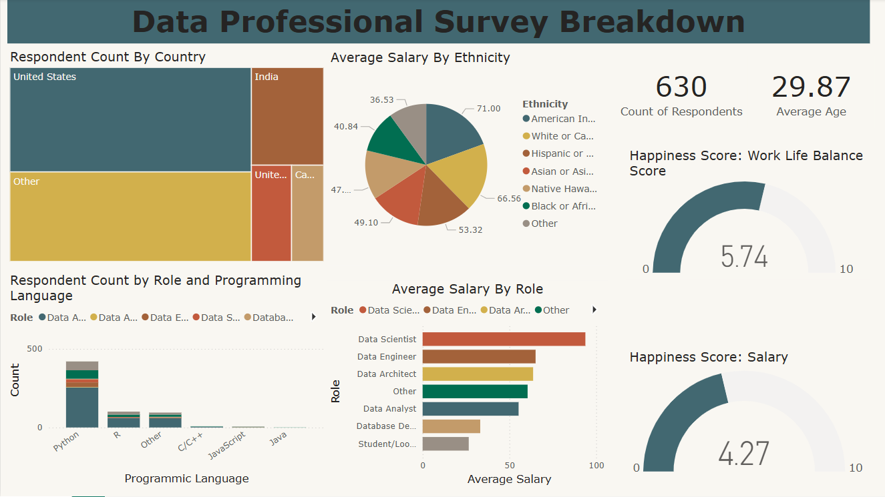

# Data Professional Survey Breakdown

*A Power BI dashboard analyzing responses from 630 data professionals.*

---

## 📝 Data

- **`Power-BI-Final-Project.xlsx`**  
  Raw survey export with columns:
  - `RespondentID`  
  - `Country`, `Age`, `Gender`, `Ethnicity`  
  - `Role`, `ProgrammingLanguages`  
  - `Salary`  
  - `Happiness_WorkLifeBalance`, `Happiness_Salary`  

The PBIX file applies simple transformations (splitting multi-select languages, computing averages, etc.) in Power Query.

---

## 🚀 Getting started

1. Download **`data/Survey_dash.pbix`** and **`data/Power-BI-Final-Project.xlsx`**  
2. Open the PBIX in Power BI Desktop.  
3. Click **Refresh** to pull in the raw data.  
4. Use slicers for **Country**, **Role**, **Programming Language**, and **Ethnicity**.

---

## 📊 Dashboard pages

### 1. Overview  
  
- **Total Respondents:** 630  
- **Avg. Age:** 29.9 years  
- Happiness gauges for Work-Life Balance and Salary.

### 2. Respondent Breakdown  
Treemap showing top countries: United States, India, Other.

### 3. Role & Language    
Bar chart of respondent count by primary role & programming language.

### 4. Salary & Ethnicity  
Pie chart of average salary across ethnic groups.

---

## 🔍 Key insights

- **Country distribution:** US (largest), India next, then Other  
- **Top languages:** Python dominates, followed by R and “Other”  
- **Highest-paid role:** Data Scientist (~\$95K avg.)  
- **Ethnicity pay gaps:** American Indian/Alaska Native at \$71K vs. Black/African American at \$40K avg.  
- **Work-life happiness:** 5.74/10; **Salary happiness:** 4.27/10  

---

## 📞 Contact

**Chirag Pandey**  
– Email: chiragpandey0504@gmail.com  
– GitHub: [@chiragpandey0504](https://github.com/chiragpandey0504)
